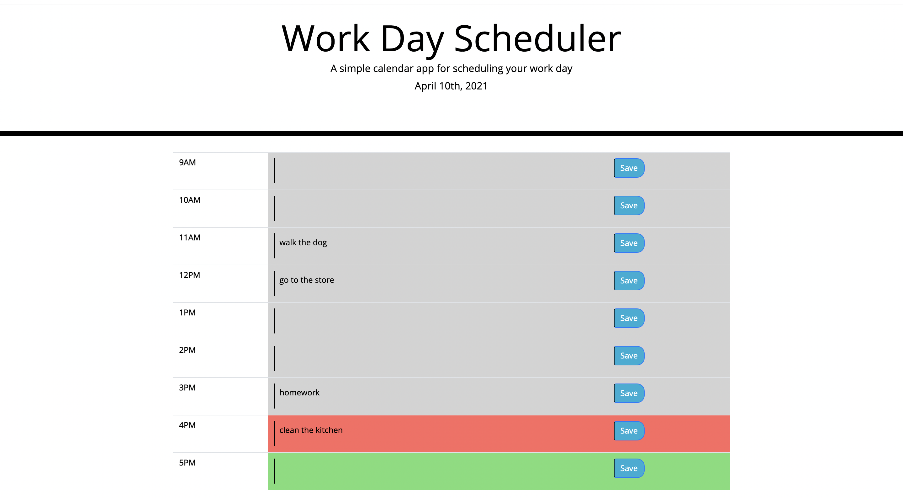

# Work Day Scheduler

This scheduler allows the user to plan and organize their work day. 

There are timeblocks for every hour which change colors to indicate past, present, and future and the user is able to save their tasks to local storage. 

## Contact 

If you wish to contact me you can reach me at melanieuhrich13@gmail.com.

## Screenshot

## Link to Deployed Application 

https://melanieuhrich.github.io/Work-Day-Scheduler/