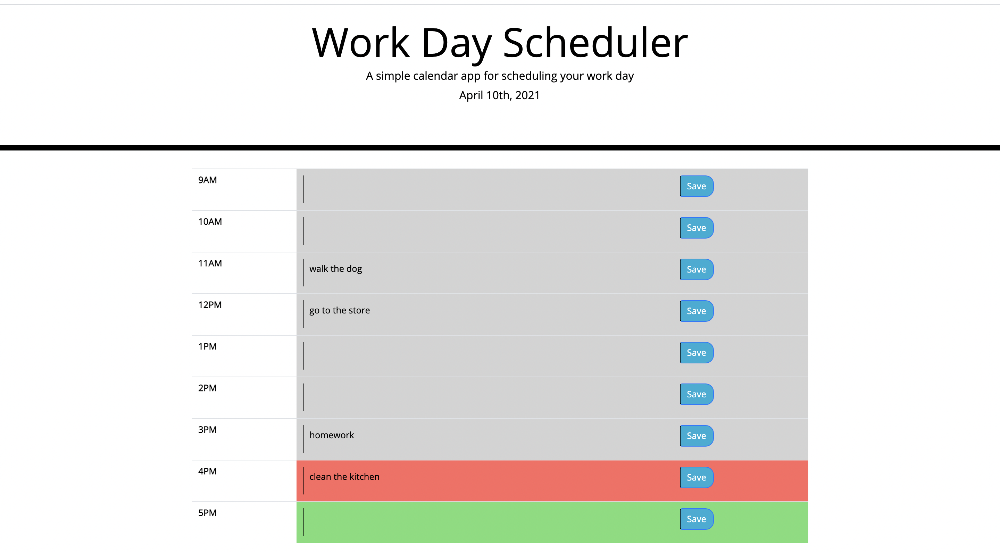

# Homework 5

# Purpose of the Assignment 

Create a workday schedule with a timeblock for every hour that changes colors for past, present, and future and allows the user to save their tasks to local storage. 

# What I Did and Why

Lines 1-2: Creates the today variable and defines it as the current moment in MMMM Do, YYYY format. Links it with the currentDay ID in the HTML and turns the today variable into text so that it displays in the correct spot. 

Lines 4-5: Creates the textArea variable and links it to the textArea class in the HTML. Gives the textArea an attibute of 'enabled' so that the user can type their task in it. 

Line 7: Calls the renderLocalStorage function.

Line 9: Calls the getHour function. 

Lines 11-19: Creates variables savedContent9-savedContent17. Defines them as the value of their corresponding text areas in the HTML. 

Lines 21-31: Declares the renderLocalStorage function. Tells it to find the IDs for each hour in the HTML and their textArea class, then to get the value of each item from localStorage according to their key. 

Lines 33-76: Finds the saveBtn class in the HTML. On a click, reminds the computer of the variables savedContent9-savedContent17. Then sets the item to localStorage according to its unique key and value.

Lines 78-93: Declares the getHour function. Tells it to find the row2 class in the HTML then creates an each loop. Creates the hour variable and defines it as the current moment in hour format. Creates the myHour variable, links it with the data-hour attribute in the HTML, and parses it. If myHour is less than hour, give the data-hour a class of past. If myHour is equal to hour, give the data-hour a class of present and remove the past class. Otherwise (if myHour is greater than hour), give the data-hour a class of future and remove the present and past classes. 

# Screenshot

# Link to Deployed Application 

https://melanieuhrich.github.io/Homework-5/